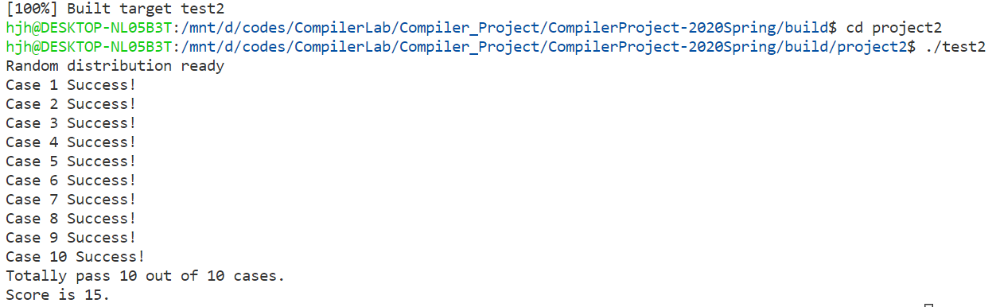

<center> 编译Project2报告 <center>
----------------------------------
## 0. 小组成员及分工
- 王育民：
- 韩佳衡：组织讨论，提出问题解决思路；设计IR_S等重点代码的结构，完成初步代码实现；生成函数签名；参与实例测试和debug，撰写报告的1、2.2、2.3、3、4部分。
- 徐德民：参与讨论目标代码设计；编写求导函数find_dx的初步代码。

项目链接：https://github.com/NeverGiveUuuuuuup/Compiler_Project/

## 1. 自动求导技术设计
### 1.1 问题描述

在传统的深度学习求导框架中，计算求导公式需要关于每个网络类型的先验知识。事实上，这个过程除了链式法则，框架还在不断地识别正向传播时使用的函数/层的名字，然后在自己的函数库里寻找对应的导函数，框架知道应该找哪个导函数，都是依赖于编写框架的人了解这些知识，然后在框架的库里准备好需要的函数们。

所谓自动求导技术，是指使用编译技术自动地根据前向算子计算定义生成其反向计算导数的函数，整个过程，不需要特意知道算
子的名称，只需要看到数学表达式即可。也就是说，完全依据数学求导原理，从前向传播原始的数学表达式中推导得到求导公式。


### 1.2 解决思路
实现自动求导技术，需要两个基础：一是精准地解析表达式结构，二是依据求导的数学原理生成新的求导公式。

前者正是我们编译器擅长做的事情。事实上，在project1中。我们已经实现了词法分析、语法分析和中间代码（语法树）的生成。

而后者可以通过遍历语法树，生成新的IR结点来解决。在已经构造好的AST（抽象语法树）中，表达式结点要么对应于一个运算变量（Ref或者Const），要么对应于一个运算符（加减乘除等）。

因此，设定求导对象后，我们就可以递归地生成求导表达式。举例来说，设求导对象是张量B，则在遍历语法树时，如果遇到一个运算分量，则导数值为1（该分量是张量B）或者0（该分量不是张量 B）；如果遇到一个加法表达式，则分别计算两个加法运算单元对张量B的导数，然后求和。

### 1.3 项目结构
分以下三步
- 词法分析和语法分析
  - 读入json文件，进行词法分析
  - 基于project1，构建输入文法的抽象语法树
- 自顶向下地进行求导运算
  - 设计SDD和SDT，对应节点生成IR结点
  - 遍历上述语法树，按照求导原理生成求导表达式
  - 生成循环语句、用于边界检查的条件代码、初始化语句等
- 生成目标代码
  - 构造函数签名
  - 遍历上述语法树，打印出C/C++源码


## 2. 代码开发
词法分析、语法分析、打印目标代码的模块，与project1的相关模块基本保持了一致，所以在这里不再赘述。
下面重点介绍求导部分的实现。

### 2.1 find_dx
#### 2.1.1 基本逻辑
对于A = B* C，求B的导数，我们总结规律，dB = dA  * (C)。也就是左值的微分乘以右值关于B的导数。所以关键再与求出右值关于B的导数，我们采用的方法是递归求导。

​自顶向下递归的进行求导。比如对右值节点求导，如果这个节点只有一个儿子，则它的求导等于对儿子几点的求导，如果有两个子节点，且他们是乘法关系，则本节点的导数等于左孩子的导数乘以右孩子节点加上左孩子和右孩子的导数的乘积，加法和减法原理相同，根据返回的导数我们很自然的就能构造出对应的IR节点。这样的递归求导一直进行到TRef或者SRef或Const节点，在这几种节点处就可以根据节点的Id是不是我们要求导的id来返回1或者0。对于有多个相同求导id的情况，比如A = B + B + B，且要求导B的时候。我们会根据递归遇到B的顺序，对第一个第二个第三个B分别求导。这时候把其他的B看成常数。这就要求三次，每次的求导的结果累加加到dB上，所以一开始我们需要对dB进行初始化，赋值为零。

然后又出现了一个问题就是递归求导，对于乘法如果有一个子节点求导后为零，其实会加上一个为零的数。比如A* B，A的导数为零B的导数为一。那结果就应该是A*1而不是A * 1 + B * 0。虽然结果是等价的，但是因为在式子里面多了B就会导致依据这个来实现的函数签名会发生错误，所以在添加了一个递归函数。来提前查看这个节点递归下去返回的是零还是非零。如果是零的话生成对应IR节点的时候就不考虑这一项。同时在递归函数里可以收集后面生成bandarycheck和下标中间变量所需要的信息。

### 2.1.2 代码说明
方法Expr find_dx(AST *RHS)被AST::IR_S()方法调用，用于递归地生成求导表达式。

AST是我们自定义的一个类（详见project1的文档），描述的是输入文法语法树的结点。IR_S方法用于访问输入文法中的S语法成分，也就是node_type是S的AST结点，它还有node_type是LHS和RHS的子AST节点。IR_S方法在访问到表达式右值（也就是RHS类型的AST结点）的时候，会以右值结点为参数，调用find_dx方法，用于生成求导公式的右值结点。
对于任意的一个RHS结点，find_dx都会生成它关于求导对象（用std::string current_grad_to来描述）的求导表达式。

函数体的基本框架，是基于对参数RHS的类型的判断：

(1) 表达式。根据表达式的运算符类型，套用求导公式。例如，当表达式的运算符是加号时，分别对两个加法元递归调用find_dx方法，然后生成对其返回值的加法表达式。代码如下：
```
if(RHS->child[1].str=="+"){
    return Binary::make( data_type, BinaryOpType::Add,
            find_dx(&ch1a),find_dx(&ch2a));
}
```

(2) TRef或者SRef。如果当前的运算分量等于当前求导对象时（用std::string current_grad_to来描述），根据数学原理知导数为1，因此构造值为1的结点，否则构造值为0的结点。

(3) Const。无论求导对象时哪一个变量，常数对其导数都没有贡献，因此返回值为0的结点。代码如下：
```
if(RHS->t == 6) {
    return Expr(int(0));
}
```

#### 2.1.3 复杂情况解决方案
尽管测试样例中包含了转置、卷积、element-wise乘法、矩阵乘法等复杂运算，但是由于我们基于project1已经建立了以加减乘除表达式为基础的抽象语法树，所以并不惧怕这些复杂运算。只是有以下两种特殊情况需要专门解决。

##### 2.1.3.1 求导对象的下标包含了运算符（以case6为例）
实际上，我们的上述基本逻辑是满足这种情况的。以case6为例，我们的输出是
```
dB[n][c][p+r][q+s] =(dB[n][c][p+r][q+s] + (dA[n][k][p][q] * (1 * C[k][c][r][s])));
```
但是根据题目要求，“分析出来的求导表达式是一个或多个赋值语句形式，每个语句左侧的下标索引上不能有加减乘除等运算，也就是不能出现 A[i+1] = B[i] 的形式”，因此，我们需要另外声明一些临时变量，用于保存对下标进行加减乘除运算的结果，也就是改为生成如下的代码：
```
int temp1, temp2;
...
temp1 =(p + r);
temp2 =(q + s);
...
dB[n][c][temp1][temp2] =(dB[n][c][temp1][temp2] + (dA[n][k][p][q] * (1 * C[k][c][r][s])));
                
```

##### 2.1.3.2 求导对象以不同下标形式在右值中多次出现（以case10为例）
当在右值结点中，求导对象以不同下标多次出现时，会产生一个问题：究竟当前的求导对象是谁？

因此，解决思路自然是罗列各个求导对象，分别对其进行求导。我们使用
```
bool more_occur=false;//判断是否多次出现求导对象
std::vector<Expr> grad_to_more_occur;//多个B的表达式，例如B[i+1][j], B[i-1][j]等，要分别生成求导式子。对应的string就是"d"+grad_to[0]

```
以case10为例，右值表达式中分别出现了B[i][j], B[i+1][j], B[i+2][j]三个求导对象，因此我们生成的代码如下：
```
dB[i][j] =(dB[i][j] + (dA[i][j] * ((0 + (0 + 1)) / (float)3)));
...
temp1 =(i + 1);
dB[temp1][j] =(dB[temp1][j] + (dA[i][j] * ((0 + (1 + 0)) / (float)3)));
...
temp2 =(i + 2);
dB[temp2][j] =(dB[temp2][j] + (dA[i][j] * ((1 + (0 + 0)) / (float)3)));      
```


### 2.2  build_IR

AST类中的build_tree成员函数在之前自顶向下解析了json中的表达式并把其根据文法，生成了一个节点树。我们的build_IR成员函数就是对这棵树后续遍历，自底部向上地收集信息并为树的每个节点生成对应的IR节点，和每个节点的bandarycheck信息。我们在IR_S中构建我们关键的IR节点，比如if判断，for循环，调用find_dx求出右值的导数。以此来构建求出导数的IR节点。对于左值下标为算式的情况，我们构建一个下标的中间变量来使得下标不是算式，虽然感觉这样一点意义也没有，不过题目是这样要求的。比如dA[i + j] = x变为 temp = i + j; dA[temp] = x;

总的来说build_IR负责利用之前收集道德信息组装出我们目标代码的IR节点，以便后面我们在后端中依据他来生成最终的目标代码。


### 2.3 函数签名
严格来说，我们生成的是函数头，而在run2.h中声明的才是函数签名。这部分代码的意义就是使两者保持一致，保证测试正确执行。因此这部分代码的规则就是遵循run2.h中函数签名的规则，也就是先生成inputs中在求导表达式中出现的那些对象(形如A、B)、然后生成对于原来表达式左值的求导对象（形如dC）、最后是求导表达式左值的那些对象（形如dA、dB）。具体细节不展开阐述。


## 3. 实验结果
按照我们的方法，圆满地实现了项目的预定目标。下面以一个实例来阐述我们方法的可行性和准确性。
### 3.1 实例说明
前面针对复杂例子都做了有针对性的说明，因此这里就选择最简单易懂的case1作为例子来展开阐述。
首先，case1的输入是：
```
{
    "name": "grad_case1",
    "ins": ["A", "B"],
    "outs": ["C"],
    "data_type": "float",
    "kernel": "C<4, 16>[i, j] = A<4, 16>[i, j] * B<4, 16>[i, j] + 1.0;",
    "grad_to": ["A"]
}
```
如在1.3节中所介绍的那样，总体上分为三步：

(1) 词法分析和语法分析
  - 读入json文件，进行词法分析
  - 基于project1，构建输入文法的抽象语法树
    
这一步先后调用了parse_json、build_tree两个方法。具体来说，针对读入的std::string进行操作，采用了自底向上的方法对输入文法进行切割(parse)。特别是对于输入文法中的RHS，也就是右值部分，类比中缀转后缀的算法和数据结构，构造了基于输入文法的语法树。

(2) 自顶向下地进行求导运算
  - 设计SDD和SDT，对应节点生成IR结点
  - 遍历上述语法树，按照求导原理生成求导表达式
  - 生成循环语句、用于边界检查的条件代码、初始化语句等

这一步调用的是build_IR方法，build_IR又根据调用者的类型分别调用了IR_P、IR_S、IR_RHS等来生成相应的目标代码成分。build_IR采用了后序的深度优先遍历方法来访问抽象语法树，于是可以自底向上地构造IR语法成分。例如IR_S负责生成循环和边界检查的代码，并把求导语句放入到循环体中，其中调用了find_dx方法来生成求导表达式。

(3) 生成目标代码
  - 构造函数签名
  - 遍历上述语法树，打印出C/C++源码
    
依据函数签名生成规则，我们可以生成如下的函数头：

```
void grad_case1(float (&B)[4][16], float (&dC)[4][16], float (&dA)[4][16])
```

之后，再调用CCPrinter类打印输出c++代码。
### 3.2 最终测试结果
```sh
mkdir build
cd build
cmake ..
make -j 4
./project2/test2
```
即可看到测试结果如下图：

可以看到全部10个case都生成成功。

## 4. 收获总结

此次作业很好地锻炼了我们对于编译课本知识的理解。如果说project1更多锻炼的是词法分析、语法分析的话，那么此次project2主要锻炼的则是遍历语法树，生成新的结点的工作。

在这个过程中，要想正确地进行求导、生成求导表达式，不仅需要我们明确数学原理上是怎么求导的，还需要我们设计清晰的SDT，明确每一个动作的时机和方法、明确如何传递属性。这些在此次作业实现、debug、和小组讨论的过程中得到了反复的锻炼，也是我们最大的收获所在。
